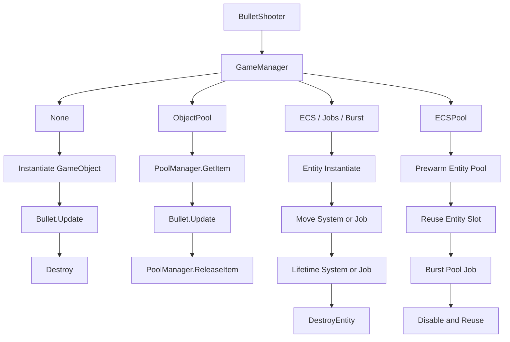

# Unity Bullet Hell Optimization

Unity에서 대량의 탄환을 처리할 때 `Instantiate/Destroy`, `Object Pool`, `ECS`, `C# Jobs`, `Burst`, `ECS Pool`이 어떤 차이를 만드는지 학습하고 비교하기 위한 프로젝트입니다.

이 프로젝트의 핵심 목적은 단순히 FPS를 높이는 것이 아니라, **Unity에서 대량 탄환 처리 방식을 단계별로 비교하고 ECS/DOTS 최적화 흐름을 학습하는 것**입니다.

## 프로젝트 목적

- Unity ECS/DOTS의 기본 구조를 학습합니다.
- C# Jobs와 Burst가 어떤 상황에서 효과가 있는지 확인합니다.
- `Instantiate/Destroy` 방식과 `ObjectPool` 방식의 차이를 비교합니다.
- Entity 생성/삭제 비용이 큰 처리 비용이 될 수 있음을 확인합니다.
- ECS Pool을 적용했을 때 구조 변경 비용을 줄이는 효과를 테스트합니다.
- 대량 탄환 처리 방식별 FPS 변화를 실험합니다.

## 테스트 환경

사용자가 테스트한 기준 환경입니다.

| 부품 | 사양 |
|---|---|
| CPU | AMD Ryzen 9 5900X |
| GPU | NVIDIA RTX 4080 |
| RAM | OLOy DDR4 8GB x 4, 3200MHz CL16 |
| Engine | Unity |
| 테스트 조건 | 슈터 4개, 각 슈터가 `0.01초`마다 `500발` 발사 |

테스트 조건을 발사량 기준으로 환산하면 다음과 같습니다.

```text
슈터 1개 = 0.01초마다 500발 = 초당 50,000발
슈터 4개 = 초당 200,000발 생성 요청
```

따라서 이 프로젝트의 테스트는 일반적인 게임 플레이 상황보다는 **극단적인 스트레스 테스트**에 가깝습니다.

## 최적화 단계

현재 프로젝트에는 `OptimizationType` enum으로 6개의 모드가 있습니다.

```csharp
public enum OptimizationType
{
    None,
    ObjectPool,
    ECS,
    ECSWithJobs,
    ECSWithJobsAndBurst,
    ECSPool
}
```

## 모드별 설명

### 1. None

가장 기본적인 방식입니다.

탄환이 필요할 때마다 `Instantiate`로 새 GameObject를 만들고, 수명이 끝나면 `Destroy`로 제거합니다.

```text
발사 요청
-> Instantiate
-> Bullet.Update에서 이동/수명 처리
-> Destroy
```

장점:

- 구현이 가장 쉽습니다.
- Unity 초보자가 이해하기 쉽습니다.

단점:

- 대량 탄환에서 가장 느립니다.
- `Instantiate`와 `Destroy`가 반복되면서 CPU 부하와 GC 스파이크가 발생할 수 있습니다.
- 탄환마다 `MonoBehaviour.Update()`가 실행됩니다.

### 2. ObjectPool

GameObject를 미리 만들어 두고 재사용하는 방식입니다.

`Instantiate/Destroy`를 반복하지 않고, `SetActive(true/false)`로 탄환을 꺼내고 되돌립니다.

```text
시작 시 탄환 미리 생성
-> 발사 시 풀에서 꺼냄
-> Bullet.Update에서 이동/수명 처리
-> 수명 종료 시 풀에 반환
```

장점:

- 런타임 중 생성/삭제 비용을 크게 줄입니다.
- `None`보다 일반적으로 안정적입니다.
- 실제 Unity GameObject 기반 게임에서 자주 쓰는 기본 최적화입니다.

단점:

- 탄환마다 여전히 `MonoBehaviour.Update()`가 실행됩니다.
- GameObject와 Transform이 많아지면 CPU 비용이 커집니다.
- 탄환 수가 수만 단위 이상으로 커지면 한계가 뚜렷합니다.

### 3. ECS

GameObject가 아니라 Entity와 Component Data를 사용합니다.

탄환의 위치, 속도, 수명 데이터를 ECS Component로 저장하고, ECS System이 순회하면서 이동과 수명을 처리합니다.

```text
발사 요청
-> Entity Instantiate
-> BulletMoveSystem에서 위치 갱신
-> BulletLifetimeSystem에서 수명 감소
-> 수명 종료 시 DestroyEntity
```

장점:

- GameObject/MonoBehaviour 방식보다 데이터 접근이 효율적입니다.
- 많은 탄환을 연속된 데이터처럼 처리할 수 있습니다.
- CPU 캐시 효율이 좋아집니다.

단점:

- 이 모드는 Job/Burst를 사용하지 않기 때문에 메인 스레드에서 처리됩니다.
- Entity를 계속 생성/삭제하면 구조 변경 비용이 발생합니다.
- 단순히 ECS로 바꾼다고 모든 비용이 사라지는 것은 아닙니다.

### 4. ECSWithJobs

ECS 탄환의 이동과 수명 처리를 `IJobEntity`로 병렬화한 방식입니다.

```text
발사 요청
-> Entity Instantiate
-> BulletMoveJobSystem에서 병렬 이동
-> BulletLifetimeJobSystem에서 병렬 수명 감소
-> 수명 종료 시 EntityCommandBuffer로 DestroyEntity 예약
```

장점:

- 여러 CPU 코어를 활용할 수 있습니다.
- 이동/수명 계산이 많아질수록 일반 ECS보다 유리합니다.
- `MonoBehaviour.Update()` 수천 개를 돌리는 구조보다 훨씬 낫습니다.

단점:

- Entity 생성/삭제 비용은 여전히 남아 있습니다.
- Job 스케줄링과 동기화 비용이 있습니다.
- 현재 코드에서는 수명 처리 후 같은 프레임에 `Complete()`와 `ECB.Playback()`을 수행합니다.

### 5. ECSWithJobsAndBurst

`ECSWithJobs`에 Burst 컴파일을 추가한 방식입니다.

```text
발사 요청
-> Entity Instantiate
-> Burst 컴파일된 이동 Job
-> Burst 컴파일된 수명 Job
-> 수명 종료 시 DestroyEntity
```

장점:

- 단순 수치 연산에서 가장 강력한 CPU 최적화를 기대할 수 있습니다.
- 탄환 이동, 수명 감소 같은 반복 계산에 적합합니다.
- 데이터 중심 구조와 잘 맞습니다.

단점:

- Entity 생성/삭제 비용은 해결하지 못합니다.
- 렌더링 비용도 별도로 남아 있습니다.
- 연산 자체가 너무 단순하면 Burst 효과가 FPS 차이로 크게 보이지 않을 수 있습니다.

### 6. ECSPool

ECS Entity를 매번 생성/삭제하지 않고, 시작 시 미리 만들어 둔 Entity 탄환을 재사용하는 방식입니다.

```text
시작 시 Entity 탄환 풀 생성
-> 발사 시 비활성 Entity 슬롯 재사용
-> Burst Job으로 이동/수명 처리
-> 수명 종료 시 Destroy하지 않고 비활성화
```

장점:

- 런타임 중 반복적인 `EntityManager.Instantiate` 비용을 줄입니다.
- 수명 종료 시 `DestroyEntity`를 하지 않아 구조 변경 비용을 줄입니다.
- 현재 테스트에서 가장 큰 FPS 개선을 보였습니다.

단점:

- 시작 시 풀을 만드는 비용이 큽니다.
- 풀 크기보다 많은 탄환이 동시에 필요하면 살아있는 탄환 슬롯을 덮어쓸 수 있습니다.
- 비활성 탄환도 풀에 존재하므로, 구현 방식에 따라 비활성 데이터 검사 비용이 남을 수 있습니다.

## 실행 흐름 비교



## 적용된 최적화 비교

| 모드 | 생성 최적화 | 이동 처리 | 수명 처리 | 제거 방식 | 관찰 포인트 |
|---|---|---|---|---|---|
| `None` | 없음 | `MonoBehaviour.Update` | `MonoBehaviour.Update` | `Destroy` | 생성/삭제, GC, Update 호출 |
| `ObjectPool` | GameObject Pool | `MonoBehaviour.Update` | `MonoBehaviour.Update` | 비활성화 후 풀 반환 | 많은 Update 호출, Transform 처리 |
| `ECS` | 없음 | ECS System 순회 | ECS System 순회 | `DestroyEntity` | Entity 생성/삭제, 메인 스레드 |
| `ECSWithJobs` | 없음 | `IJobEntity` | `IJobEntity` | ECB `DestroyEntity` | Entity 생성/삭제, Job 동기화 |
| `ECSWithJobsAndBurst` | 없음 | Burst Job | Burst Job | ECB `DestroyEntity` | Entity 생성/삭제, 렌더링 |
| `ECSPool` | Entity Pool | Burst Job | Burst Job | 비활성화 후 재사용 | 풀 순회, SetComponentData, 렌더링 |

## 테스트 결과 예시

사용자 테스트 기준:

```text
슈터 4개
각 슈터: 0.01초마다 500발
전체: 초당 200,000발 생성 요청
```

| 모드 | 관측 FPS |
|---|---|
| `None` | 최소 8, 최대 10, 시간이 지나며 8 근처로 하락 |
| `ObjectPool` | 최소 8, 최대 12, 변동이 큼 |
| `ECS` | 최소 11, 최대 12 |
| `ECSWithJobs` | 약 12, 비교적 안정적 |
| `ECSWithJobsAndBurst` | 약 12 |
| `ECSPool` | 약 24 |

간단한 막대 비교:

```text
None                8-10 FPS  | ########
ObjectPool          8-12 FPS  | ##########
ECS                11-12 FPS  | ###########
ECSWithJobs            12 FPS | ############
ECSWithJobsAndBurst    12 FPS | ############
ECSPool                24 FPS | ########################
```

현재 문서에 기록한 수치는 간단한 FPS 관측 결과입니다. Unity Profiler의 CPU Timeline, GC Alloc, Rendering, Entity Structural Change, Job System 분석 자료는 아직 첨부하지 않았습니다.

따라서 이 결과는 최종 성능 결론이 아니라, 각 모드의 대략적인 프레임 변화만 비교한 1차 테스트 기록입니다. 상세 프로파일러 캡처는 추후 추가할 예정입니다.

## 추후 첨부 예정

- Unity Profiler CPU Timeline 캡처
- GC Alloc 및 메모리 사용량 비교
- `EntityManager.Instantiate` / `DestroyEntity` / `EntityCommandBuffer.Playback` 비용 비교
- Rendering 비용 비교
- Editor Play Mode와 Standalone Build 결과 비교
